1. **Introduction :**

I have selected the farmer&#39;s market dataset to explore data cleanup tools. This dataset is an interesting collection of farmers market listings to include: market locations, directions, social media links, operating times, product offerings, accepted forms of payment, and more. The collection includes about 7845 unique market name (excluding duplicates/redundancies) from 2010 to the present and also this dataset contains markets that feature two or more farm vendors selling agricultural products directly to customers at a common, recurrent physical location which is an interesting fact. There are currently 8688 entries in the farmers market directory and it looks like the data is generally entered by a market manager through the following URL which is one of the reason why there are data inconsistencies including format issues, data integrity issues and incompleteness.

URL to add/update the farmers data :

  [https://www.ams.usda.gov/services/local-regional/food-directories-update](https://www.ams.usda.gov/services/local-regional/food-directories-update)

There are some interesting interactive visualizations available in the following location :

[https://www.ams.usda.gov/resources/infographics-data-visualizations](https://www.ams.usda.gov/resources/infographics-data-visualizations)

The dataset contains the following CSV file.

Farmers-market.csv

2. **Structure of the dataset :**

Farmers\_Market\_Info will be the key table in the database and will contain the following fields in the table. FMID will be the primary key and market\_name, street, city, county, state and zip will be made the candidate keys.

- fmid – An int type field to uniquely identify a record.
- market\_name – A string field representing the name of the farmers market. The entries are duplicated because each unique fmid represents a farmers market in a specific location. There are data format issues which should be resolved.
- website – A string field containing the website URL to the farmers market. There are a lot of  empty entries.
- street – A string field containing the street address of the farmer&#39;s market. There are blank entries in lot of cases.
- city – A string field containing the city name of the market.
- county – A string field containing the county name of the market. County names are blanks or empty values in some cases.
- state – A string field containing the state name of the market.
- zip – A string field containing the zip code of the market. Zip code values are blank for some of the records corresponding to farmers market in a specific location in the dataset.
- latitude (field name &quot;x&quot; in the dataset) : A numeric field representing the latitude of the farmer&#39;s market. The data format is not numeric and needs to be converted to numeric
- longitude (field name &quot;y&quot; in the dataset) : A numeric field representing the longitude of the farmer&#39;s market. The data format is not numeric and needs to be converted to numeric.
- location : A string field describing the location of the business. There are lot of empty entries and data inconsistency needs to be resolved.
- updatetime – This is a date field that represents the date and time when the specific farmers market entry was created.
- season1Date – A date field representing the start and end date of season1 for the respective farmer&#39;s market. There are empty values in the season1Date field for some of the markets entries.
- season1Time – A date/time field representing the day of the week the market is open in season1 and the hours of operation for the respective day of week.
- season2Date – A date field representing the start and end date of season2 for the respective farmer&#39;s market. There are empty values in the season2Date field for some of the markets entries.
- season2Time – A date/time field representing the day of the week the market is open in season2 and the hours of operation for the respective day of week.
- season3Date – A date field representing the start and end date of season3 for the respective farmer&#39;s market. There are empty values in the season3Date field for some of the markets entries.
- season3Time – A date/time field representing the day of the week the market is open in season3 and the hours of operation for the respective day of week.
- season4Date – A date field representing the start and end date of season4 for the respective farmer&#39;s market. There are empty values in the season4Date field for some of the markets entries.
- season4Time – A date/time field representing the day of the week the market is open in season4 and the hours of operation for the respective day of week.
- credit, WIC, WICcash, SFMNP, SNAP – These are one character indicator fields for the different payment methods.
- organic – A one character indicator field representing if the farmers market offers organic products or not. There are null value entries for some cases.
- bakedgoods, cheese, crafts, flowers, eggs, seafood, herbs, vegetables, honey, jams,

maple, meat, nursery, nuts, plants, poultry, prepared, soap, trees, wine, coffee, beans, fruits, grains, juices, mushrooms, petFood, tofu – These are one character indicator fields for different product offerings. They represent if the product is offered or not in the specific market. The indicator values are blank in some cases because the information was not entered.

- wildHarvested – A one character indicator field and holds some empty values.

2.1 **Potential Use Cases (with or without additional cleanups) :**

- Farmers markets that are available during different seasons in different regions of the country (Northeast, South, West, Midwest) and based on number of days in a week and hours of operation determine popularity of the markets.
- How many farmers markets sell organic meat, poultry, vegetables etc. and in what regions of the country? Which region has the most farmers market presence selling only organic products will be an interesting finding and drilling down further to identify specific locations within the region
- Farmers market segmentation based on operating location – For example, farmers market that operate in federal building grounds, private parking lots etc. and how long have they been in existence?
- Farmers market that accept cash only payments or cash and card or include other payment methods too.
- Identifying farmers market that offer specific products along with region/location could indicate potential high gross produce of those products in those locations/regions.
- What and how many farmers market exist in multiple locations  and do they offer different products based on location/region ?

2.2 **Is the dataset good enough ?**

- The market name is not consistent across different locations and this is a data inconsistency that should be resolved to use this dataset for any kind of analysis.
- The date formats are inconsistent across the dataset and not all inconsistencies can be resolved but can be resolved on most cases. There are data records with empty or blank date fields too.
- There are leading and trailing spaces in several fields ( for example – city name field ) that should be resolved.
- The latitude and longitude values don&#39;t appear to be in numeric format and should be corrected.
- The season dates can be split into multiple fields as season1\_start\_date and season1\_end\_date etc. which will make date formatting and ultimately writing SQL queries easier using the separated fields.
- All the indicator fields are empty in many data records and cannot be used. The null values in some of the fields should be converted to the value &quot;N&quot;
- The county field is blank in several data records and so is the zip code field.
- The location field is blank in several cases and they have leading and trail
- The social media links will be ignored in the schema for the purposes of this project as they hold low significance.

3. **OpenRefine**

3.1  **Transformation on marketname column in the dataset:**

1. Clustering operation with keying function as &quot;fingerprint&quot; and method as &quot;Key Collision&quot;. Screenshot with examples provided below.

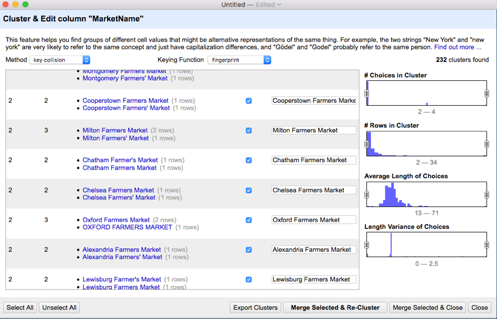

2. Clustering operation with keying function as &quot;ngram-fingerprint&quot; and method as &quot;Key Collision&quot;. Screenshot with examples provided below.

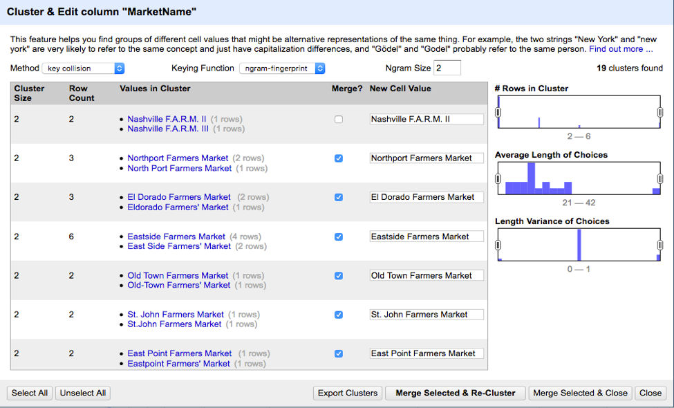

3. Clustering operation with keying function as &quot;fingerprint&quot; and method as &quot;cologne-phonetic&quot;. Screenshot with examples provided below.

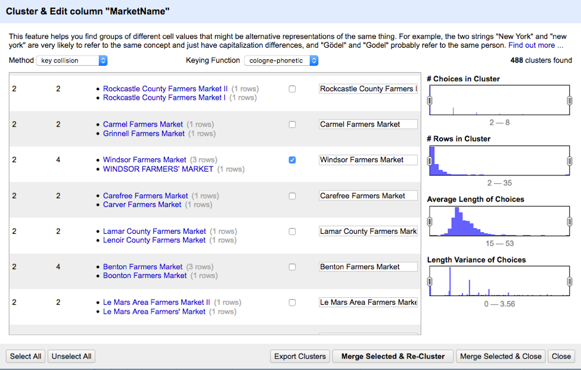

4. Changed the values to all uppercase in marketname field.
5. Leading and trailing spaces trim transformation was applied to all values in the marketname field.
6. Collapse continuous whitespace transformation was applied to all values in the marketname field.
7. Replaced special characters like [&amp;],[&#39;],[-],[.] with &quot;&quot;.

- value.replace(&quot;&#39;&quot;,&quot;&quot;)
- value.replace(&quot;&amp;&quot;,&quot; AND &quot;)
- value.replace(&quot;.&quot;,&quot;&quot;)
- value.replace(&quot;-&quot;,&quot;&quot;)

3.2  **Transformation on street column in the dataset:**

1. Clustering operation with keying function as &quot;fingerprint&quot; and method as &quot;Key Collision&quot;. Screenshot with examples provided below.

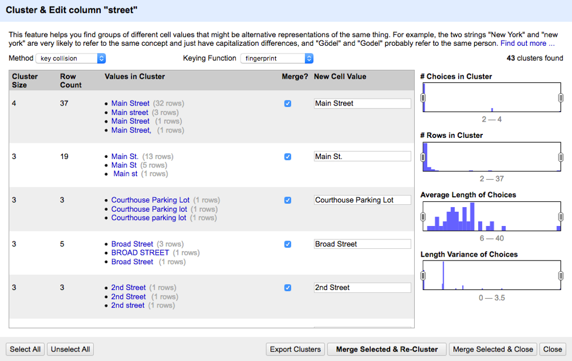

2. Clustering operation with keying function as &quot;ngram-fingerprint&quot; and method as &quot;Key Collision&quot;. Screenshot with examples provided below.

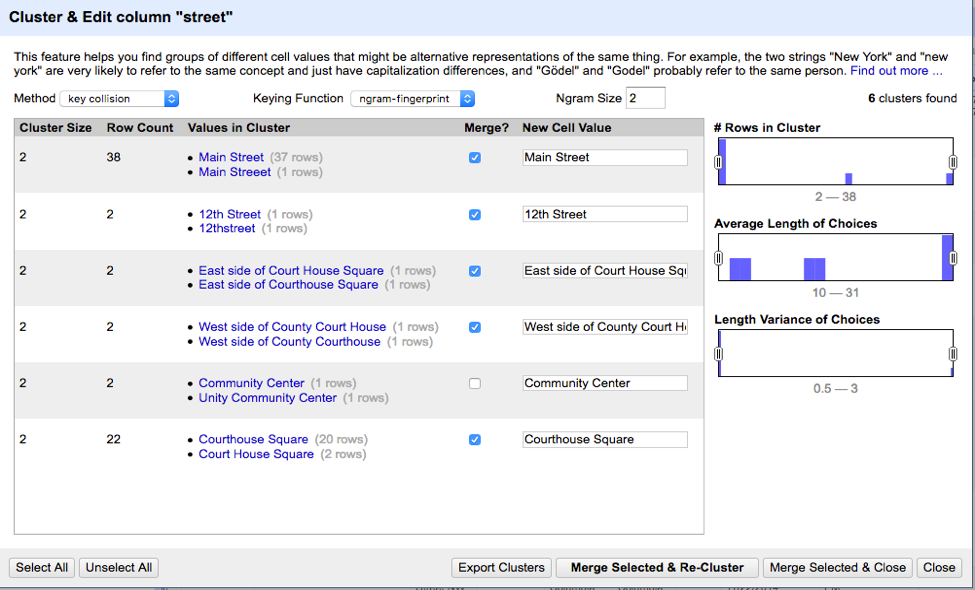

3. Leading and trailing spaces trim transformation was applied to all values in the street field.
4. Collapse continuous whitespace transformation was applied to all values in the street field.
5. Changed the values to all uppercase in the street field.
6. Replaced special characters like [&amp;],[#],[/],[.],[,] with &quot;&quot;.

- value.replace(&quot;#&#39;&quot;,&quot;&quot;)
- value.replace(&quot;&amp;&quot;,&quot; AND &quot;)
- value.replace(&quot;.&quot;,&quot;&quot;)
- value.replace(&quot;/&quot;,&quot;&quot;)
- value.replace(&quot;,&quot;,&quot;&quot;)

3.3  **Transformation on city column in the dataset:**

1. Clustering operation with keying function as &quot;fingerprint&quot; and method as &quot;Key Collision&quot;. Screenshot with examples provided below.

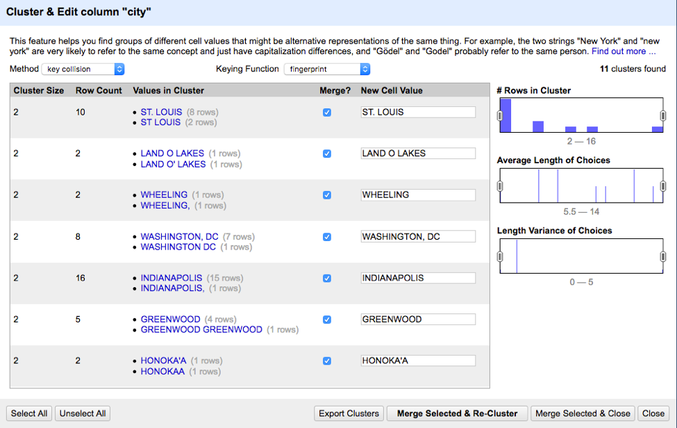

2. Clustering operation with keying function as &quot;ngram-fingerprint&quot; and method as &quot;Key Collision&quot;. Screenshot with examples provided below.

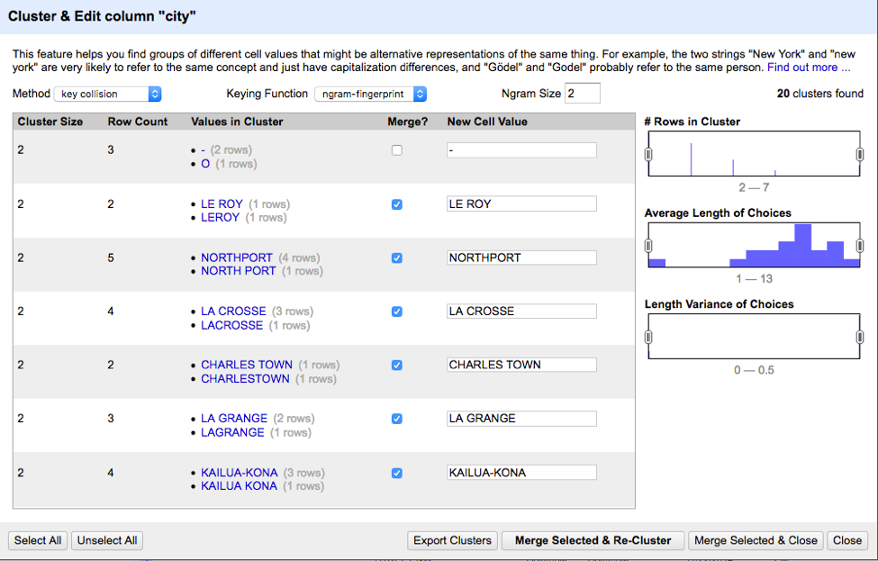

3. Leading and trailing spaces trim transformation was applied to all values in the city field.
4. Collapse continuous whitespace transformation was applied to all values in the city field.
5. Changed the values in the city field to all uppercase.

3.4  **Transformation on county column in the dataset:**

1. Clustering operation with keying function as &quot;ngram-fingerprint&quot; and method as &quot;Key Collision&quot;. Screenshot with examples provided below.

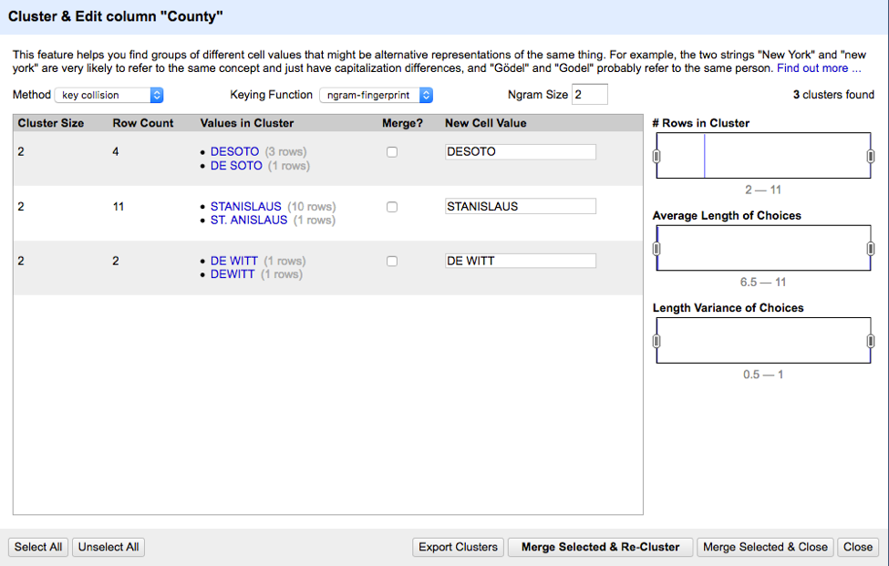

2. Changed the values in the county field to all uppercase.

3.5  **Transformation on state column in the dataset:**

- Changed all the values in this field to all uppercase.

3.6  **Transformation on FMID, latitude and longitude fields in the dataset:**

- Converted the values in this field to all numeric from text.

3.7  **Removed columns Facebook, Twitter, Youtube and Other Media columns from the dataset.**

3.8  **Transformation on updateTime field in the dataset:**

- Converted the values in this field to date format.

3.9  **Transformation on organic field in the dataset:**

- Replaced all NULL values in the organic field to the value &quot;N&quot; using GREL - value.replace(&quot;-&quot;,&quot;N&quot;)

3.10 **Transformation on Season1Date field in the dataset:**

- Split the Season1Date field into two columns as Season1\_Start\_Date and Season1\_End\_Date using &quot;to&quot; as the separator.
- Trimmed leading and trailing spaces in the Season1\_Start\_Date and converted the data type to Text.
- Trimmed leading and trailing spaces in the Season1\_End\_Date and converted the data type to Text.

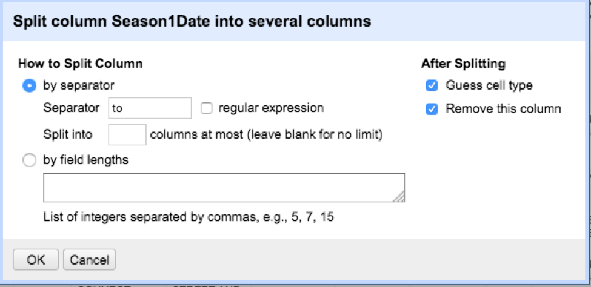

3.11 **Transformation on Season2Date field in the dataset:**

1. Split the Season2Date field into two columns as Season2\_Start\_Date and Season2\_End\_Date using &quot;to&quot; as the separator.
2. Trimmed leading and trailing spaces in the Season2\_Start\_Date and converted the data type to Text.
3. Trimmed leading and trailing spaces in the Season2\_End\_Date and converted the data type to Text.

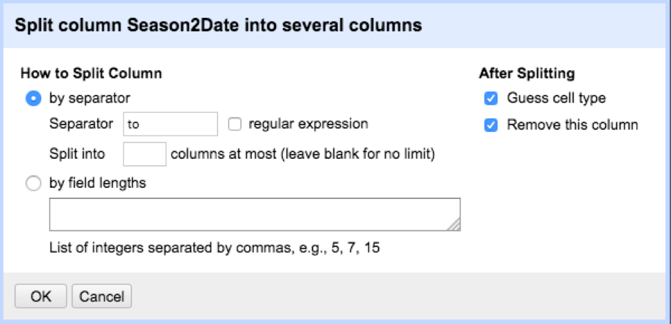

3.12 **Transformation on Season3Date field in the dataset:**

1. Split the Season3Date field into two columns as Season3\_Start\_Date and Season3\_End\_Date using &quot;to&quot; as the separator.
2. Trimmed leading and trailing spaces in the Season3\_Start\_Date and converted the data type to Text.
3. Trimmed leading and trailing spaces in the Season3\_End\_Date and converted the data type to Text.

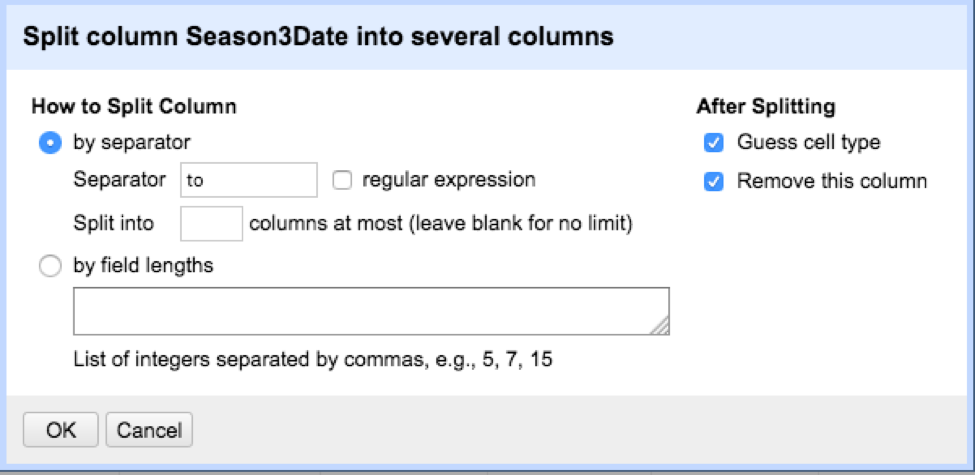

3.13 **Transformation on Season4Date field in the dataset :**

1. Split the Season4Date field into two columns as Season4\_Start\_Date and Season4\_End\_Date using &quot;to&quot; as the separator.
2. Trimmed leading and trailing spaces in the Season4\_Start\_Date and converted the data type to Text.
3. Trimmed leading and trailing spaces in the Season4\_End\_Date and converted the data type to Text.

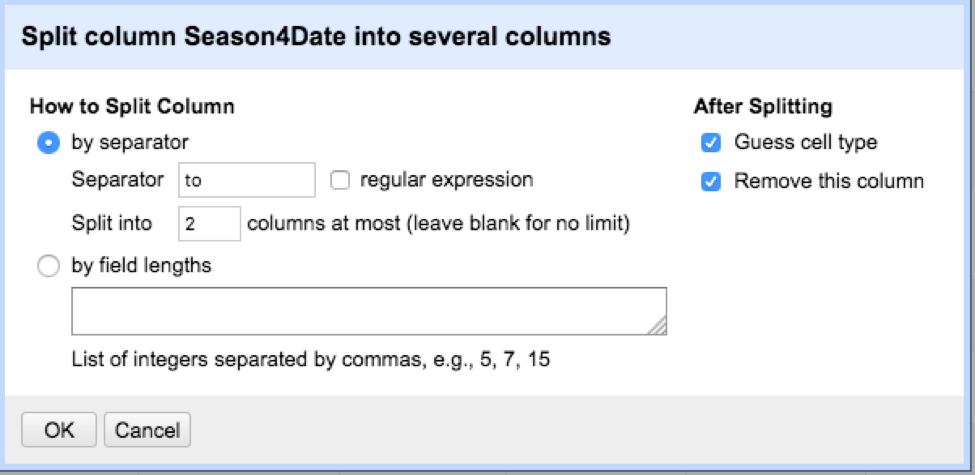

3.14 **Transformation on fields x and y in the dataset :**

- The fields x and y in the farmers market dataset were renamed as latitude and longitude.

4. **Operation History and Provenance :**

The entire operation history was exported from OpenRefine as a JSON file which has been attached to this report under the artifacts section. To check provenance, a new project was created in OpenRefine with the original farmers market csv file and applied this JSON file. This automatically executed all the transformations on all the columns. We exported the new csv and compared with CS598\_farmers\_markets.csv file using mac filemerge compare utility and the two files were identical proving that the transformation are 100% replicable.

5. **Schema and Tables :**

The OpenRefine cleaned Farmers Markets dataset was loaded into a SQLite database successfully and split into four tables logically and a foreign key relationship has been established between these tables. Based on the initial review of the dataset it seemed like the dataset can be logically broken down into four parts as a primary master table containing the market name and address info, a payments table containing the payment methods, a seasons table containing the dates and times during which the markets are active and a products table containing the different products offered in the each of the markets. The FMID is a primary key and has been reused in all the four tables to establish a foreign key relationship. Splitting the dataset into four tables increases efficiency and provides optimization.

**5.1 Tables :**

1. Farmers\_Markets\_Info
2. Farmers\_Markets\_Seasons
3. Farmers\_Markets\_Products
4. Farmers\_Markets\_Payments

**5.2 ER Diagram :**

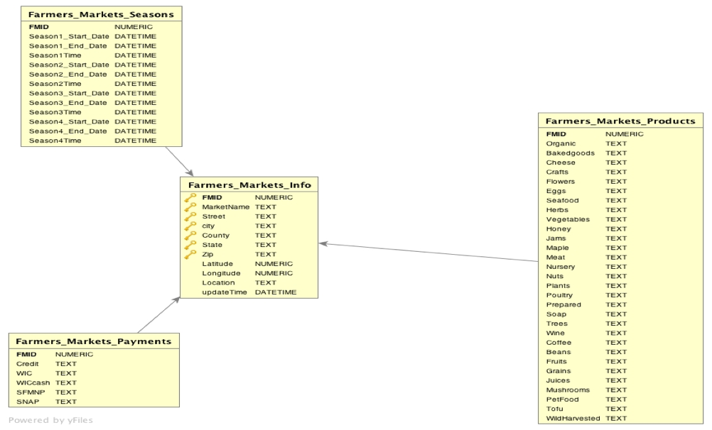

**5.3 Data Definition Language :**

**5.3.1 Table Definition for Farmers\_Markets\_Info :**

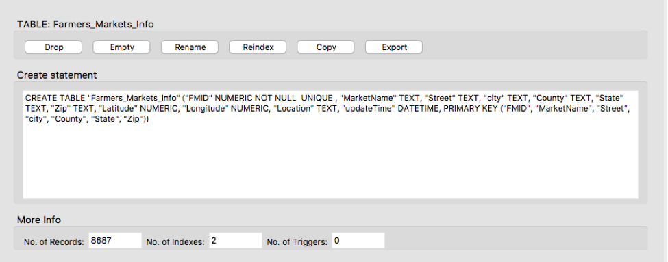

**5.3.2 Table Definition for Farmers\_Markets\_Payments :**

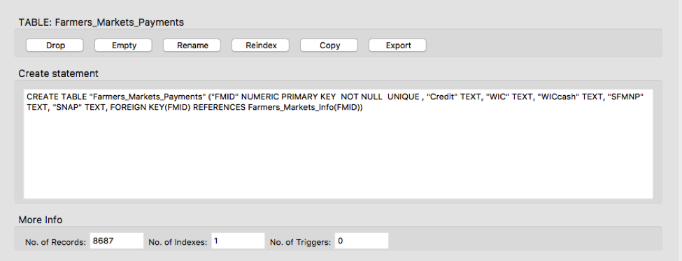

**5.3.3 Table Definition for Farmers\_Markets\_Products :**

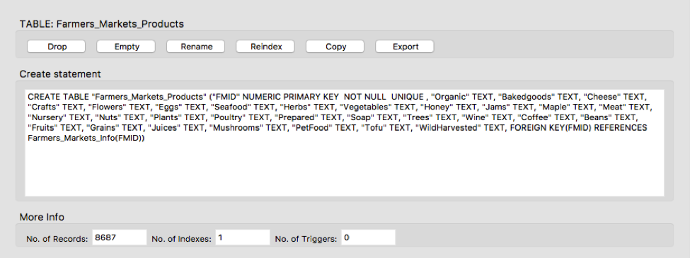

**5.3.4 Table Definition for Farmers\_Markets\_Seasons :**

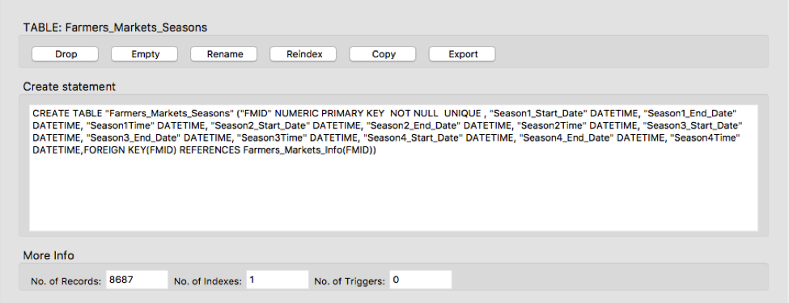

**5.3.5 Integrity check on the database after cleanups:**

**6. Integrity Constraints :**

I assumed that each combination of FMID, market name, street, city, county, state and zip should have a unique FMID entry. Based on my review of data specifically in the case of duplicate market name entries, same market names in several cases existed in different locations but had a unique FMID for that location and market name combination. I found,

843 duplicates in the market name field

36 duplicates in the street, city, county, state and zip combination.

But, these duplications seemed to be ok except for 1 case where the same market name, stree, city, county and zip combination had two different FMIDs and this was the only IC violation that I had to resolve. I executed the following queries against the database to resolve this IC violation and the total count of records in all the tables after resolving the IC violation was 8686.

**6.1 Integrity Constraint Resolution:**

Following is the SQL query I executed in the Farmers\_Markets\_Info table to identify the IC violation.

Query-1:

Select a.fmid, a.marketname, a.street,a.city, a.county, a.state, a,zip,
b.fmid,  b.marketname, b.street, b.city, b.county, b.state,b,zip
from farmers\_markets\_info a,  farmers\_markets\_info b
where a.fmid &lt;&gt; b.fmid  and a.marketname = b.marketname  and b.street = a.street
and b.city = a.city and a.zip = b.zip and a.county = b.county and a.state = b.state;

The above query resulted in 1 IC violation on FMIDs – 1012768, 1017955.

I decided to deleted the entry with FMID - 1012768 because it had a updateTime less than the FMID - 1017955 meaning FMID – 1012768 was the oldest entry and should be deleted.

Following DELETE queries were executed on the other related tables to delete the entry with FMID = 1012768. The delete queries had to be executed in the dependent tables before deleting the Farmers\_Markets\_Info primary table due to foreign key relationship.

Query-2:

Delete from Farmers\_Markets\_Payments where FMID = 1012768;

Query-3:

Delete from Farmers\_Markets\_Products where FMID = 1012768;

Query-4:

Delete from Farmers\_Markets\_Seasons where FMID = 1012768;

Query-5:

Delete from Farmers\_Markets\_Info where FMID = 1012768;

**7. Provenance - YesWorkflow :**

The end to end workflow was created using the YesWorkflow tool. The chart was created using the online version of YesWorkflow and the image file was generated through image capture from the browser.

The workflow uses the farmersmarkets.csv file and OpenRefine&#39;s json file as input and the run operation produces a cleaned up version of the csv file. The cleaned up file is then imported into SQLite and additional cleanup is performed.

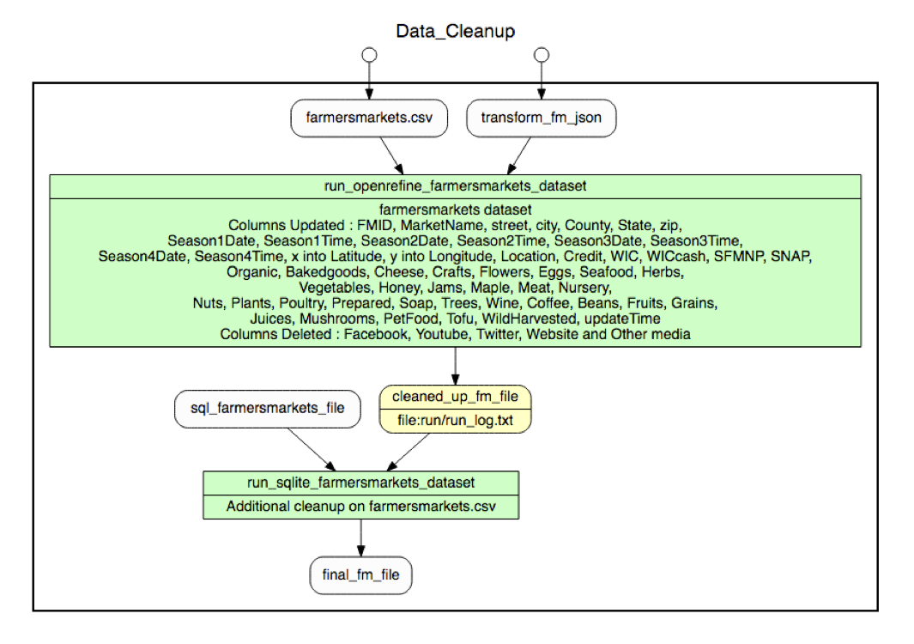

**8. Observations and Conclusions :**

The quality of the original dataset provided was poor, it had format issues, data inconsistencies and data integrity issues. While it is obvious that data was gathered through crowd-sourcing still some parts of the data were usable without the need for additional cleaning. OpenRefine along with regular expressions was used to resolve format issues, data inconsistencies, date formatting and to remove special/unnecessary characters in the data. The clustering features in OpenRefine were used to merge similar words and phrases. We also eliminated columns that were of very low significance or not needed which reduced the size of the dataset significantly. Despite the extensive cleaning through OpenRefine, we encountered data integrity issues and other format issues while importing the data into SQLite.

This project has provided me with great traction in the area of data cleaning and deeper understanding into the practical utility of various tools like OpenRefine for cleaning, YesWorkflow for provenance and the SQLite database. I did explore additional tools and found tools like DbVisualizer ( [www.dbvis.com)](http://www.dbvis.com)) that can connect to several databases including SQLite and can help in developing schemas and layouts quickly. The schema diagram that I incorporated above was developed through this tool.

In essence, I believe that I have improved the quality of dataset significantly, made it more usable and structured for better understanding through the schema I developed in SQLite and ready for more analytics.
